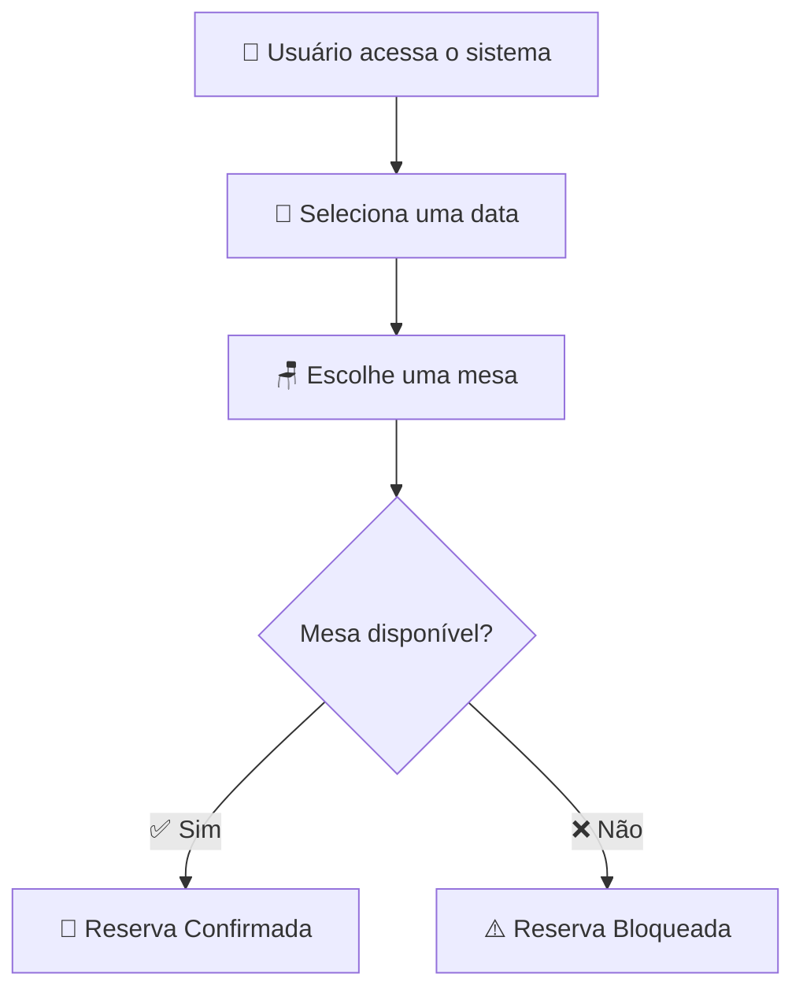

<div align="center">

# 🪑✨ DeskGo — Reserva de Estações ✨🪑

### 💼 Sistema inteligente para gerenciamento de coworkings


<br>

> ### 🚀 “Transformando espaços compartilhados em experiências organizadas.”

</div>

---

# 🌎 Sobre o Projeto

O **DeskGo** foi criado para facilitar a organização de ambientes de coworking e escritórios compartilhados, permitindo reservas rápidas, inteligentes e sem conflitos.

Com uma interface simples e moderna, usuários conseguem reservar mesas facilmente enquanto gestores mantêm o controle total das estações disponíveis.

---

# 🎯 Objetivo

> Criar uma experiência organizada, eficiente e intuitiva para ambientes colaborativos.

✨ O sistema busca:

- 🧩 Melhorar a gestão de espaços
- ⚡ Automatizar reservas
- 📅 Organizar disponibilidade
- 🤝 Facilitar o uso compartilhado

---

# 👥 Perfis do Sistema

<table>
<tr>
<td align="center" width="50%">

## 👤 Usuário

📅 Reservar mesas  
❌ Cancelar reservas  
🔎 Consultar disponibilidade  
🪑 Escolher estações

</td>

<td align="center" width="50%">

## 🛠️ Gestor

➕ Cadastrar mesas  
📝 Gerenciar descrições  
📊 Controlar reservas  
👀 Visualizar ocupação

</td>
</tr>
</table>

---

# ✨ Funcionalidades

# 🪑 Gestão de Estações

```diff
+ Cadastro de mesas
+ Controle de disponibilidade
+ Organização de espaços
+ Gerenciamento inteligente
```

---

# 📝 Descrição das Mesas

Cada estação pode possuir características específicas:

| Mesa | Recursos |
|------|-----------|
| 🪟 Mesa Janela | Vista externa |
| 🔌 Mesa Power | Tomada próxima |
| 🤫 Mesa Focus | Ambiente silencioso |
| 👥 Mesa Duo | Espaço para dupla |

---

# 📅 Sistema de Reservas

```yaml
Reserva:
  ✔ Escolha de data
  ✔ Visualização do calendário
  ✔ Consulta de disponibilidade
  ✔ Reserva instantânea
  ✔ Cancelamento simples
```

---

# 🧠 Regra Principal do Sistema

<div align="center">

## ⚠️ Validação Inteligente

</div>

```txt
❌ Não é permitido reservar a mesma mesa duas vezes no mesmo dia.
```

Essa validação garante:

- ✅ Organização
- ✅ Controle de ocupação
- ✅ Evita conflitos
- ✅ Melhor experiência para todos

---

# 🚀 Fluxo da Reserva



---

# 🛠️ Tecnologias Utilizadas

<div align="center">

| 💻 Tecnologia | 🚀 Função |
|---|---|
| ☕ Java | Linguagem principal |
| 🍃 Spring Boot | Backend |
| 🗄️ MySQL | Banco de dados |
| 🌐 HTML | Estrutura |
| 🎨 CSS | Estilização |
| ⚡ JavaScript | Interatividade |

</div>

---

# 📂 Estrutura do Projeto

```bash
📦 deskgo
 ┣ 📂 src
 ┃ ┣ 📂 controller
 ┃ ┣ 📂 service
 ┃ ┣ 📂 repository
 ┃ ┣ 📂 model
 ┃ ┣ 📂 config
 ┃ ┗ 📂 resources
 ┣ 📂 database
 ┣ 📜 pom.xml
 ┗ 📜 README.md
```

---

# ⚙️ Como Executar

## 📥 Clone o projeto

```bash id="0n2mec"
git clone https://github.com/seu-usuario/deskgo.git
```

---

## 📂 Entre na pasta

```bash id="7duf0f"
cd deskgo
```

---

## ▶️ Execute a aplicação

```bash id="0mywha"
./mvnw spring-boot:run
```

---

# 📌 Requisitos Funcionais

- [x] Cadastro de mesas
- [x] Descrição das estações
- [x] Calendário de disponibilidade
- [x] Reserva por data
- [x] Cancelamento de reservas
- [x] Validação contra conflito

---

# 🌟 Futuras Melhorias

```diff
+ Dashboard administrativo
+ Aplicativo mobile
+ Notificações automáticas
+ Reservas em tempo real
+ Relatórios de ocupação
```

---

# 👨‍💻 Desenvolvedores

<div align="center">

| 👨‍💻 Gabriel Gama | 👩‍💻 Victoria |
|---|---|

</div>

---


<div align="center">

## 🪑✨ DeskGo Organization ✨🪑

### Organização • Tecnologia • Eficiência

⭐ Obrigado por visitar nosso projeto! ⭐

</div>
