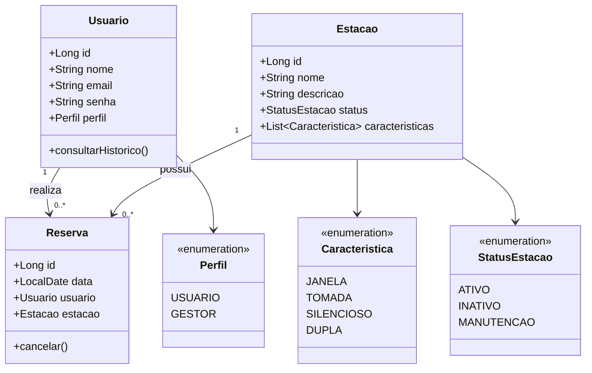

# 📊 Diagrama de Classes — DeskGo

Este diagrama representa a estrutura de dados principal do sistema DeskGo.

```mermaid
classDiagram
    class Usuario {
        +Long id
        +String nome
        +String email
        +String senha
        +Perfil perfil
        +consultarHistorico()
    }

    class Perfil {
        <<enumeration>>
        USUARIO
        GESTOR
    }

    class Estacao {
        +Long id
        +String nome
        +String descricao
        +StatusEstacao status
        +List~Caracteristica~ caracteristicas
    }

    class Caracteristica {
        <<enumeration>>
        JANELA
        TOMADA
        SILENCIOSO
        DUPLA
    }

    class StatusEstacao {
        <<enumeration>>
        ATIVO
        INATIVO
        MANUTENCAO
    }

    class Reserva {
        +Long id
        +LocalDate data
        +Usuario usuario
        +Estacao estacao
        +cancelar()
    }

    Usuario "1" --> "0..*" Reserva : realiza
    Estacao "1" --> "0..*" Reserva : possui
    Usuario --> Perfil
    Estacao --> Caracteristica
    Estacao --> StatusEstacao
```
