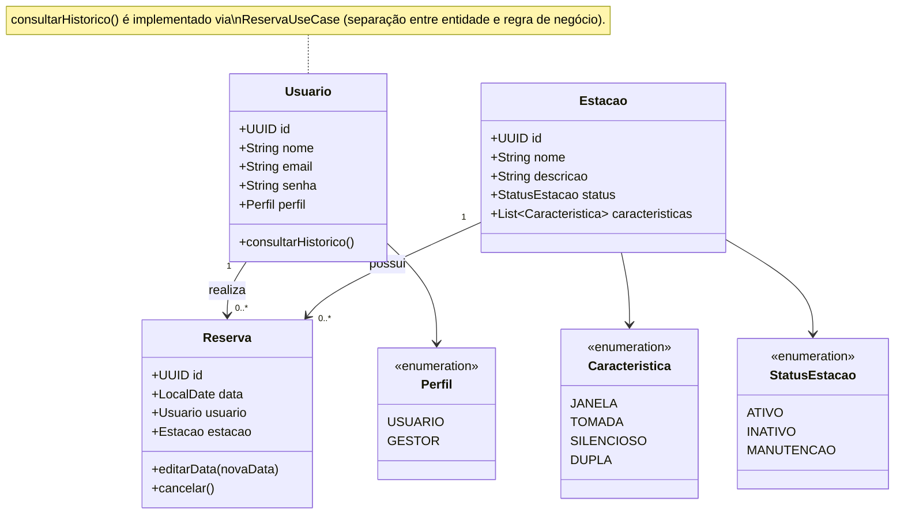

# 📊 Diagrama de Classes — DeskGo

Este diagrama representa a estrutura de dados principal do sistema DeskGo.

> **Nota Arquitetural:** No diagrama, a classe `Usuario` apresenta o método `consultarHistorico()`, e a `Reserva` apresenta `editarData(novaData)`. Na implementação real do sistema (MVC + UseCases), essas funcionalidades existem encapsuladas no `ReservaUseCase`. Essa decisão reflete uma separação de responsabilidades (Clean Architecture), mantendo as entidades mais limpas e delegando regras de negócio complexas aos Casos de Uso (como as verificações de conflito de datas na edição de reservas).
